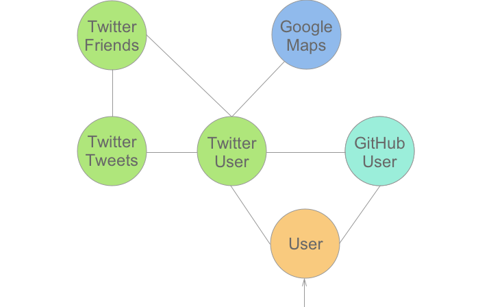

# GraphQL Bridge Demo

This repositiory is a demo for the usage of npm-package *graphql-bridge*  (https://www.npmjs.com/package/graphql-bridge)

It features the illustrated types and connections:

The root query provides the possibility to enter any name and find the corresponding GitHub or Twitter account.

Inside of an Twitter User you can request his or her Tweets, Friends and even the reverse geocoded location. (This is done with the GoogleMaps API)

Every Twitter User has friends that are also Twitter Users, which means you can for example also get the friends of friends and all other combinations.

The last feature is a connection between a Twitter User and a GitHub User, so you can also look for the GitHub accounts of your friends.

## Installation

Since this concept involves a lot of costly API communication I can't provide an live demo of this. This repository is mostly meant to be a reference for the usage of the *graphql-bridge* library.

If you still want to host your own version, create a `.env` file with the tokens and keys in the `.env.sample` file.

You can obtain your tokens here:

Twitter:  https://gist.github.com/elmariachi111/6168585

GitHub: https://github.com/settings/tokens/new

GoogleMaps: https://developers.google.com/maps/documentation/javascript/get-api-key

## Experimental Branch

The second branch in this repository features some highly experimental where I used Apollos Schema Stitching to use the whole GitHub Graph and GraphQL Compose JSON to create the types. If you are interested, check it out (no pun intended 🤓)
